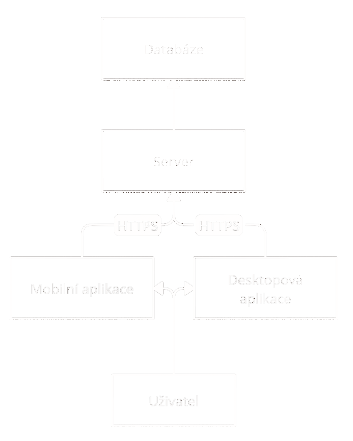

# Fit life

## Název projektu
Název projektu "Fit Life" není finální. Tento název už používá několik společností a nebylo by dobré ho použít z legálních i marketingových důvodů.

## Cíl projektu
Cílem projektu Fit Life je umožnit uživateli přehledně vidět svojí fyzickou a digitální aktivitu. Uživatel je tedy schopen vidět realitu, jak tráví svůj čas. 
Aplikace Fit Life mu dále ukáže tipy na to, jak optimalizovat svojí aktivitu, aby byla dlouhodobě zdravá a udržitelná.

## Rozsah projektu
Aplikace Fit Life bude mít dvě klientské aplikace. Hlavní cílová platforma jsou telefony. Kvůli povaze projektu je však nutné připravit i aplikaci na desktop. (Nutnost sbírat informace kolik času tráví uživatel na zařízení)

### Mobilní aplikace
Mobilní aplikace poslouží uživateli k prohlížení svých dat a tipů pro svoje zdraví. Mobilní platforma je primární cíl v oblasti frontendu. Bude napsána ve flutteru.

### Desktopová aplikace
Desktopová aplikace poslouží podobně jako mobilní aplikace uživateli k prohlížení dat a tipů pro svoje zdraví. Bude také napsaná ve flutteru.

### Server
Na serveru poběží business logika aplikace. Klient bude posílat na server údaje o používání aplikací a o fyzické aktivitě uživatele. Ten tyto údaje bude zpracovávat a ukládat do databáze.

Klient bude získávat a odesílat informace serveru pomocí HTTPS requestů.

### Databáze
V databázi budou dvě tabulky. Databáze bude v PostgreSQL.

#### Tabulka uživatelů
Tabulka uživatelů má uloženy všechny registrované uživatele.
Bude mít následovné sloupečky.
| Pole              | Datový typ           |
|-------------------|----------------------|
| id                | int (pk)             |
| first_name        | varchar(60)          |
| last_name         | varchar(60)          |
| gmail             | varchar(255)         |
| registration_date | date                 |
| last_login_date   | date                 |

#### Tabulka aktivit
Tabulka aktivit obsahuje veškeré uložené aktivity.
| Pole             | Datový typ             |
|------------------|------------------------|
| user_id          | int (fk)               |
| activity         | varchar(255)           |
| start_time       | timestamptz            |
| end_time         | timestamptz            |

## Zdroje dat

### Klientské aplikace
Hlavním zdrojem dat o aktivitě uživatele jsou klientské aplikace. Tyto aplikace odesílají informace o tom, jakou dobu uživatel používá různé aplikace.

### Google API
Vedlejším zdrojem je Google API. Z tohoto API je pro tento projekt použit google fitness activity, která umožňuje sledovat počet kroků uživatele v určitém časovém období.

## Frontend

### Domovská stránka
Uživateli si bude moci zobrazit časovou osu s aktivitami, které dělal v určitý čas. Pod touto časovou osou se mu zobrazí sestupně seřazený seznam aktivit s časem na nich strávený.

### Stránka s tipy
Uživateli si na této stránce zobrazí tipy, jak lépe využívat svůj čas. Současně dostane odkazy na další materiály pro případné studium uživatele.

### Stránka s nastavením
Stránka s nastavením umožní uživateli nastavit notifikace, jak stará data se mají vymazávat a podobné nastavení.

V nastavení si také uživatel může smazat účet.

## Milestones
| Měsíc        | Cíl                                  |
|--------------|--------------------------------------|
| Leden        | Rámcová analýza                      |
| Únor         | Přihlašování a zpracování Google API |
| Březen       | Získávání a ukládání aktivit         |
| Duben        | Frontend                             |
| Květen       | Tipy uživateli                       |
| Červen       | Dolaďování                           |

## Diagram

